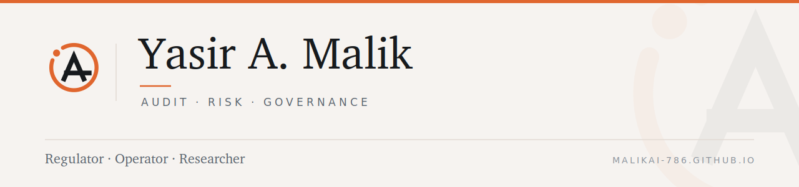

<p align="center">
  <picture>
    <source media="(prefers-color-scheme: dark)" srcset=".github/brand/banner-dark.png">
    <source media="(prefers-color-scheme: light)" srcset=".github/brand/banner-light.png">
    
  </picture>
</p>

I examined banks as a regulator, ran audits inside two of them, and built and
shipped an AI tool into a live audit function. Now I research what happens to
professional judgment when the evidence arrives pre-interpreted.

```
REGULATOR    Safety-and-soundness examination — OCC, Florida OFR
OPERATOR     Fifteen years in audit and risk — Citigroup, JPMorgan Chase, to VP
BUILDER      Production RAG assistant shipped inside Citi's audit function
RESEARCHER   DBA candidate, Florida International University — expected 2028
```

### What I work on

**Cognitive bias in audit judgment.** An eleven-construct, fifty-five-item
measurement model grounded in dual-process theory and the anchoring-and-
adjustment heuristic. The question underneath it: in a recurring engagement,
does this year's judgment follow this year's evidence — or last year's number?

**AI and professional judgment.** Where that question goes next. A system
tuned on human approval tends to affirm the position you already hold — and it
is most agreeable exactly where a reviewer most needs pushback. As successive
models reprocess the same work, conclusions converge on each other rather than
on evidence, and the record, written with the same tools, remembers the drift
as consensus. That is a control problem, not just a technology problem.

### Selected work

| | |
| --- | --- |
| [**MalikAI-786.github.io**](https://github.com/MalikAI-786/MalikAI-786.github.io) | Research, advisory practice, and the identity system |
| [**MalikAI-786-spx**](https://github.com/MalikAI-786/MalikAI-786-spx) | Applied-AI research instrument — governance, calibration, integrity hashes |
| [**claudebot-onboarding**](https://github.com/MalikAI-786/claudebot-onboarding) | A practical walkthrough for colleagues new to LLM tooling |
| [**DeepLearning**](https://github.com/MalikAI-786/DeepLearning) · [**NLP**](https://github.com/MalikAI-786/Natural_Language_Processing) · [**Time Series**](https://github.com/MalikAI-786/Time_Series) | Applied ML on financial data |
| [**BlockChain**](https://github.com/MalikAI-786/BlockChain) · [**Decentralized Apps**](https://github.com/MalikAI-786/Decentralized-Apps) | Distributed-ledger work from first principles |

### On how I use these tools

I use AI systems intensively — which is precisely why I study their failure
modes. The risk I research is not hypothetical to me; it is the risk in my own
workflow, managed deliberately. The judgment, synthesis and interpretation are
mine.

---

<sub><b>Yasir A. Malik</b> · Audit · Risk · Governance — <a href="https://malikai-786.github.io">malikai-786.github.io</a> · <a href="https://linkedin.com/in/yasiramalik">LinkedIn</a> · Newark, NJ · NYC metro</sub>
